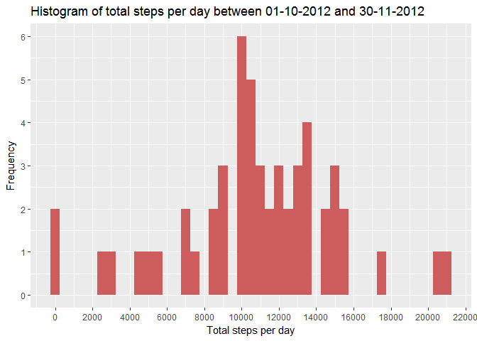
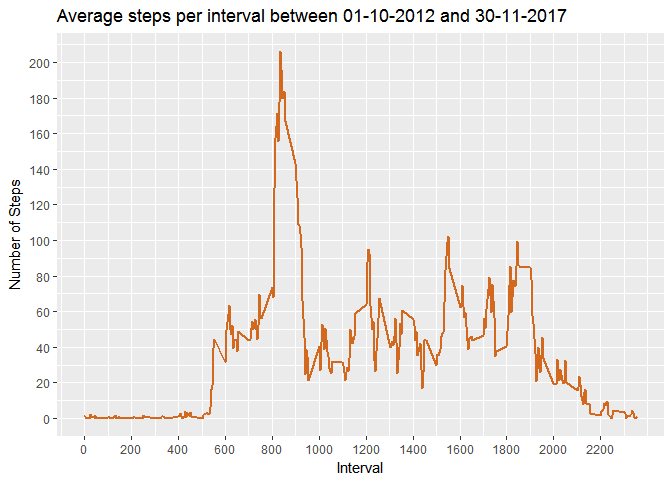
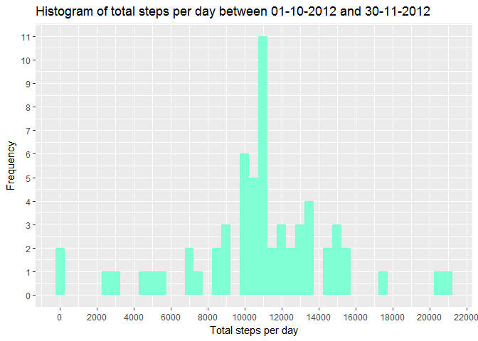
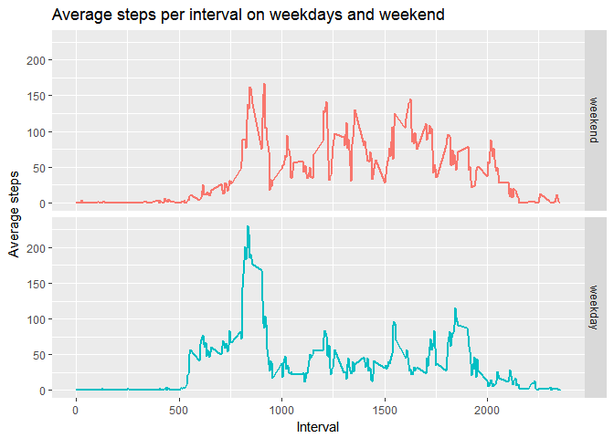

# Reproducible Research: Peer Assessment 1
René Molkenthin  
 Aug 13, 2017  

The document describes the steps done to solve the peer assessment assignment. 

## Required libraries


*Dplyr* is used for data handling, grouping and preparing for plots and histograms.  
*Ggplot2* is used for plotting.  
*Lubridate* is used for date handling, in particular retrieving the number of the day of the week.


## Loading and preprocessing the data
First it is checked if the file already exists. If not the zip file will be downloaded and unzipped to the current working directory. The resulting csv file will be read into data frame. Finally the data types are adjusted, especially the date will be transformed in a specific format.

```r
fileUrl <- "https://d396qusza40orc.cloudfront.net/repdata%2Fdata%2Factivity.zip"
fzip <- "repdata%2Fdata%2Factivity.zip"
fname <- "activity.csv"

if(!(file.exists(fname))) {
    download.file(fileUrl, destfile = fzip, method = "auto")
    unzip(fzip)
}

## read data into data frame
df_act <- read.csv(fname, header = TRUE, sep = ",", 
                   stringsAsFactors = FALSE, na.strings = "NA")

## Date coercion
df_act$steps <- as.integer(df_act$steps)
df_act$interval <- as.integer(df_act$interval)
df_act$date <- as.Date(df_act$date, format = "%Y-%m-%d")
```


## What is mean total number of steps taken per day?
### Histogram of the total steps per day
The following code creates a histogram which shows the distribution of the daily total number of steps between Oct 1 and Nov 30, 2012. For grouping and aggregating the steps dplyr is used. 


```r
df01 <- df_act %>% group_by(date) %>% summarize(totalSteps = sum(steps))

## Histogram
ggplot(df01, aes(totalSteps)) + 
    geom_histogram(binwidth = 500, fill = "indianred") +
    labs(title = "Histogram of total steps per day between 01-10-2012 and 30-11-2012", 
         x ="Total steps per day", y = "Frequency") + 
    scale_x_continuous(breaks = seq(0, 25000, 2000)) +
    scale_y_continuous(breaks = seq(0, 10, 1))
```

```
## Warning: Removed 8 rows containing non-finite values (stat_bin).
```

<!-- -->
### Mean and Median of total steps
The histogram already showed the distribution around 10500 steps as an average of daily steps. The following table shows the mean and the median. 


```r
## Table on Mean and Median
c("Mean" = mean(df01$totalSteps, na.rm = TRUE),
        "Median" = median(df01$totalSteps, na.rm = TRUE))
```

```
##     Mean   Median 
## 10766.19 10765.00
```
Both, mean and median are close which leads to the assumption of less outliers.  

## What is the average daily activity pattern?
An initial question is the daily pattern as average of steps per interval. dplyr is used to group the values by the interval and calculate the mean. The resulting data frame is plotted as a line chart. The line chart shows a peak of 200 steps per interval between the intervals 800 and 900.


```r
## Time series: Intervals averaged accross the days
df02 <- df_act %>% group_by(interval) %>% 
    summarize(avgSteps = round(mean(steps, na.rm = TRUE), 2))
ggplot(df02, aes(x = interval, y = avgSteps)) +
    geom_line(color = "chocolate", size = 1) +
    labs(title = "Average steps per interval between 01-10-2012 and 30-11-2017",
         y = "Number of Steps", x = "Interval") +
    scale_x_continuous(breaks = seq(0, max(df02$interval), 200)) + 
    scale_y_continuous(breaks = seq(0, 500, 20))
```

<!-- -->

The following table spedifies the peak and determines the related interval.

```r
## Maximum of average steps accross the intervals
df02[df02$avgSteps == max(df02$avgSteps),]
```

```
## # A tibble: 1 × 2
##   interval avgSteps
##      <int>    <dbl>
## 1      835   206.17
```

## Imputing missing values

The previous explorative plots ignore missing values. To determine how many missing t values are existing the following code is applied.


```r
## Total number of rows with NA in steps
sum(is.na(df_act$steps))
```

```
## [1] 2304
```
That indicates more than 10% missing data based on the total number of observations. Hence a replacement strategy will be applied next. The basic strategy is to use the already calculated averages per interval. These values will be used to replace the NA values for a specific interval.


```r
## Replacing NAs with interval's mean
df_act_nna <- left_join(df_act, df02, by = "interval")
df_act_nna$steps[is.na(df_act_nna$steps)] <- as.numeric(df_act_nna$avgSteps)
## clean up of helper column
df_act_nna$avgSteps <- NULL

df03 <- df_act_nna %>% group_by(date) %>% summarize(totalSteps = sum(steps))
```

The following histogram after the replacement shows only minimal changes in the distribution in general. However the impact of the replacement strategy is an increased frequency around the average values. 

```r
##histogram with replaces values
ggplot(df03, aes(totalSteps)) + 
    geom_histogram(binwidth = 500, fill = "aquamarine") +
    labs(title = "Histogram of total steps per day between 01-10-2012 and 30-11-2012", 
         x ="Total steps per day", y = "Frequency") + 
    scale_x_continuous(breaks = seq(0, 25000, 2000)) +
    scale_y_continuous(breaks = seq(0, 12, 1))
```

<!-- -->

The following table shows that there are minor changes regarding mean and median compared to the calculation without any missing value replacement. 

```r
## Table on Mean and Median with replaced values
c("Mean" = mean(df03$totalSteps, na.rm = TRUE),
        "Median" = median(df03$totalSteps, na.rm = TRUE))
```

```
##     Mean   Median 
## 10766.18 10766.13
```
Mean and median are now closer to each other than before the replacement.

## Are there differences in activity patterns between weekdays and weekends?
The daily activity pattern are already examined. However there are differences assumed between workdays and weekend patterns. Therefore, the the data with replacement of missing values is grouped by workdays and weekends. 


```r
## Comparison between weekdays and weekends
## using wday -> 1, 7 means Sunday resp. Saturday
df_act_nna <- cbind(df_act_nna, "day" = ifelse(wday(df_act_nna$date) %in% c(1, 7), 0, 1))
df_act_nna$day <- factor(df_act_nna$day, levels = c(0, 1), labels = c("weekend", "weekday"))

## summarizing by weekday or weekend and interval
df04 <- df_act_nna %>% group_by(day, interval) %>% summarize(avgStepsInt = mean(steps))
```

The following plot shows the different activity pattern on weekdays and weekends. On weekdays there is a morning peak with relatively low activity later. On weekends the activity level is higher over the day.


```r
## panel plot
ggplot(df04, aes(x = interval, y = avgStepsInt, color = day)) +
    geom_line(size = 1) +
    facet_grid(day ~.) +
    labs(title = "Average steps per interval on weekdays and weekend", 
         x = "Interval", y = "Average steps") +
    theme(legend.position = "none")
```

<!-- -->

